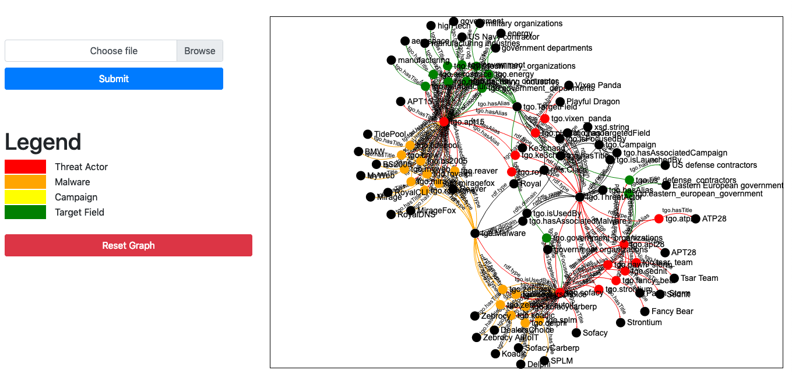

# TAGraph - Knowledge Graph of Threat Actor
A Framework to construct knowledge graph of threat actor that extracted from online cybersecurity blogposts.

## Running the Code
Currently, the project only tested in Python 3. So, please use python 3 to run the project.

* Install all the required packages first using this line
```python
pip install -r requirements.txt
```

After installing the neccessary packages, the experiment can be started by generating features that will be used to train Named-Entity Recognition (NER) System using Conditional Random Field (CRF).

* The line below will split the data into **80%** of training data and **20%** of testing data. After running this line, it will create **train.p** and **test.p** files which can later be used to train a CRF model.
```python
python trainer.py -t train_data -s 0.2
```

* Then, the training of the model can be invoked using the following line. Noted that the available *algorithm* can be found in this [link](https://python-crfsuite.readthedocs.io/en/latest/pycrfsuite.html#pycrfsuite.Trainer).
```python 
python trainer.py -c 1 -f train.p -m crf.model -g <algorithm>
```

* The performance of the trained model can be evaluated using the following line.
```python
python trainer.py -r 1 -f test.p -m crf.model
```

* Finally, the NER system can be used to extract threat actor related entities from article and generate RDF graph using format called [Turtle](https://www.w3.org/TR/turtle/). This step will generate a ttl file for the respective article.
```python 
python article2graph.py -a <article.txt> -m <crf.model>
```

* Then the ttl files can be merge together using the command below.
```python
python ttlmerge.py -f <list-of-ttl-files>
```

## Visualizing TAGraph
* To visualize the graph created, the ttl file must be converted into respective json format first. This can be done by running the command below.
```python 
python ttl2json.py -t <article.ttl>
```

* Start the web app to visualize the graph by running the Flask app using this command. The app can be viewed by visit this link [http://127.0.0.1:5000](http://127.0.0.1:5000).
```python
python TAGraph_Visualizer/graph_app.py
```

